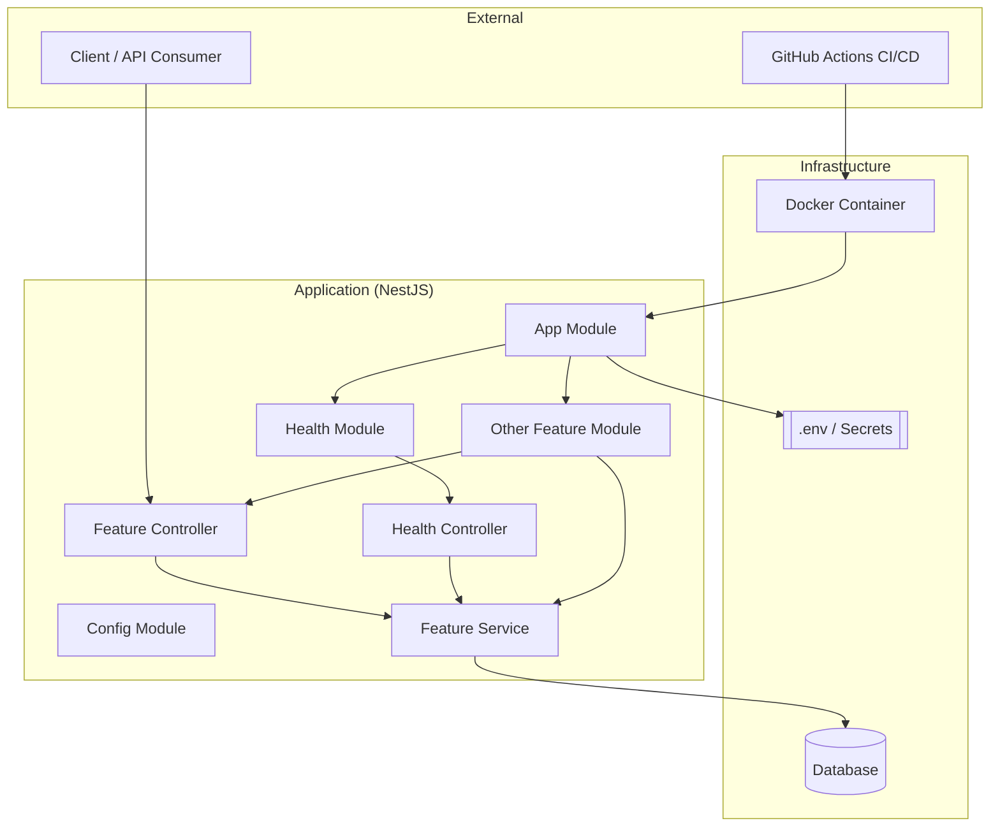
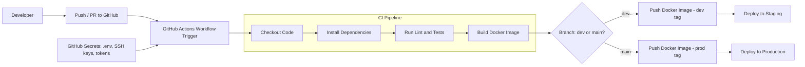

# Architecture Overview

This document provides a high-level overview of the architecture for the **nest-devops-starter** project. It explains the structure, key components, and DevOps practices used in this starter template.

## 📊 System Architecture Diagram (Mermaid)


---
## 📊 CI/CD Diagram (Mermaid using `graph LR`)


---

## 📦 Stack Overview

| Layer                | Technology                       |
|----------------------|----------------------------------|
| Language             | TypeScript                       |
| Framework            | [NestJS](https://nestjs.com/)    |
| Package Manager      | npm / pnpm                       |
| Containerization     | Docker, Docker Compose           |
| CI/CD                | GitHub Actions                   |
| Linting & Formatting | ESLint, Prettier                 |
| Testing              | Jest                             |
| ORM / DB (optional)  | TypeORM or Prisma (configurable) |

---

## 🧱 Project Structure
```
src/
├── app.module.ts          # Root NestJS module
├── main.ts                # App entry point
├── modules/               # Feature modules
│   └── health/            # Example: health check module
│       ├── health.module.ts
│       └── health.controller.ts
├── common/                # Common utilities, DTOs, interceptors
├── config/                # Environment configuration
test/                      # Jest unit & e2e tests
.env.example               # Example environment variables

Each feature is encapsulated in its own module for scalability and maintainability (following the **Modular Architecture** pattern encouraged by NestJS).

```

---

## ⚙️ Configuration

Environment-specific variables are handled via `.env` files and managed in the `config/` module using `@nestjs/config`.

- Sensitive variables are **not** committed to source control.
- A sample file `.env.example` is provided.

---

## 🐳 Docker & Deployment

This project supports containerized development and deployment:

- `Dockerfile`: Production-ready container
- `docker-compose.yml`: Local development with services like PostgreSQL
- Built with multi-stage builds for optimized image size

Example:

```bash
docker-compose up --build
````

---

## 🚀 CI/CD Workflow

CI/CD is implemented using **GitHub Actions**.

* On push or PR to `main` or `develop`:

  * Run tests
  * Lint code
  * Build the Docker image
* You can extend this pipeline to include:

  * Automatic deployments to environments (e.g., staging, production)
  * Vulnerability scanning

Example config: `.github/workflows/ci.yml`

---

## ✅ Testing Strategy

* **Unit Tests**: With Jest, in `src/**/__tests__` or alongside each module.
* **E2E Tests** (optional): With Supertest or similar.
* Run tests with:

  ```bash
  npm run test
  ```

---

## 🔐 Security & Best Practices

* Strict TypeScript configuration
* Linting + formatting enforced by pre-commit hooks (optional)
* Security headers and validation using NestJS middlewares and pipes
* Docker image scanning recommended in CI

---

## 📈 Observability (Optional)

* Includes a basic `/health` endpoint using NestJS's built-in health checks (`@nestjs/terminus`)
* Ready for integration with Prometheus, OpenTelemetry, etc.

---

## 🔄 Future Enhancements

* Add support for database migration tools (e.g., `typeorm-cli` or Prisma Migrate)
* Integration with Secrets Manager or Vault
* Infrastructure-as-code (e.g., Terraform, Pulumi)

---

## 🧩 Extending the Project

To add a new feature module:

```bash
nest generate module my-feature
nest generate controller my-feature
nest generate service my-feature
```

Don’t forget to update `app.module.ts` and write tests.

---

## 📚 References

* [NestJS Docs](https://docs.nestjs.com/)
* [Docker Best Practices](https://docs.docker.com/develop/)
* [GitHub Actions Docs](https://docs.github.com/en/actions)

```

---
